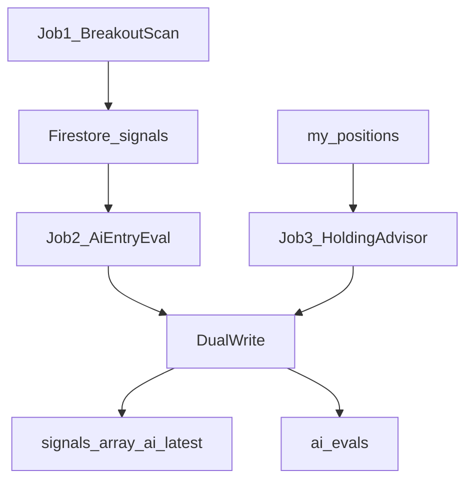

# AI Signal Pipeline

Two-stage BUY pipeline plus a holding advisor for **trading-signals**.

The dashboard **Signals** page shows stored AI summaries (View). It does **not** dispatch AI jobs; use the [RUNBOOK](./RUNBOOK.md) (CLI / GitHub Actions).

| Job | Role |
|-----|------|
| **1 — Breakout scan** | Rule-based candidates → Firestore `signals` with `ai_gate=pending` |
| **2 — AI entry eval** | Screen pending BUYs → clear `recommendation`, hard gate, dual-write usage |
| **3 — Holding advisor** | Open positions → `HOLD`/`TIGHTEN`/`EXTEND`/`EXIT` + optional hold/stop revise |



## Docs in this folder

- [ARCHITECTURE.md](./ARCHITECTURE.md) — jobs, gates, Firestore shapes
- [VERDICT_SCHEMA.md](./VERDICT_SCHEMA.md) — clear recommendation contract
- [USAGE_AND_ANALYTICS.md](./USAGE_AND_ANALYTICS.md) — hybrid storage, tokens, UI
- [RUNBOOK.md](./RUNBOOK.md) — local + GHA commands
- [PROMPTS.md](./PROMPTS.md) — prompt file map

## Config (`config.yaml`)

```yaml
ai:
  enabled: true
  entry_min_total: 70
  entry_min_conviction: 0.7
  max_entry_evals_per_run: 15
  max_holding_evals_per_run: 20
  model: gpt-4.1
  pricing:
    gpt-4.1:
      prompt_per_1m: 2.0
      completion_per_1m: 8.0
```

Secrets: `OPENAI_API_KEY`, `FINNHUB_API_KEY`, `GOOGLE_APPLICATION_CREDENTIALS`.
