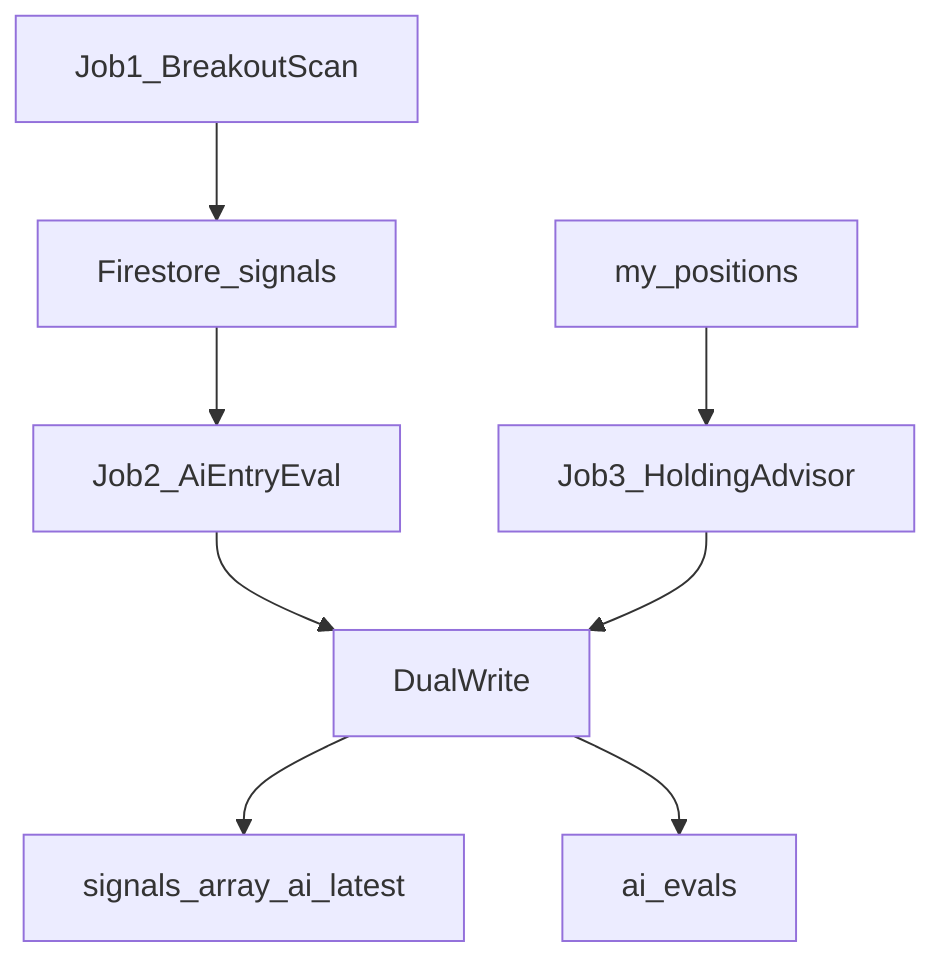

# AI Signal Pipeline

Two-stage BUY pipeline plus a holding advisor for **trading-signals**.

The dashboard **Signals** page shows stored AI summaries (View). It does **not** dispatch AI jobs; use the [RUNBOOK](./RUNBOOK.md) (CLI / GitHub Actions).

| Job | Role |
|-----|------|
| **1 — Breakout scan** | Rule-based candidates → Firestore `signals` with `ai_gate=pending` |
| **2 — AI entry eval** | Screen pending BUYs → clear `recommendation`, hard gate, dual-write usage |
| **3 — Holding advisor** | Open positions → `HOLD`/`TIGHTEN`/`EXTEND`/`EXIT` + optional hold/stop revise |


```mermaid
flowchart TD
  scan[Job1_BreakoutScan] --> buys[Firestore_signals]
  buys --> entryAi[Job2_AiEntryEval]
  entryAi --> dualWrite[DualWrite]
  dualWrite --> rowLatest[signals_array_ai_latest]
  dualWrite --> histDocs[ai_evals]
  openPos[my_positions] --> holdAi[Job3_HoldingAdvisor]
  holdAi --> dualWrite
```

## Docs in this folder

- [ARCHITECTURE.md](./ARCHITECTURE.md) — jobs, gates, Firestore shapes
- [VERDICT_SCHEMA.md](./VERDICT_SCHEMA.md) — clear recommendation contract
- [USAGE_AND_ANALYTICS.md](./USAGE_AND_ANALYTICS.md) — hybrid storage, tokens, UI
- [RUNBOOK.md](./RUNBOOK.md) — local + GHA commands
- [PROMPTS.md](./PROMPTS.md) — prompt file map

## Config (`config.yaml`)

```yaml
ai:
  enabled: true
  entry_min_total: 70
  entry_min_conviction: 0.7
  max_entry_evals_per_run: 8   # LLM top-N; continuation-band never rule_skipped (2026-08-30)
  max_holding_evals_per_run: 3 # 2026-08: cut holding volume (429 relief)
  holding_min_hours_between_evals: 24
  lottery_entry_min_total: 80
  lottery_entry_min_conviction: 0.8
  lottery_force_pro_model: false  # lottery hard-rejected by rules; avoid expensive pro
  entry_model: gpt-5.4
  holding_model: gpt-5.4-mini
  pro_model: ""   # gpt-5.4-pro is Responses-API-only; leave empty for chat/completions
  pro_min_technical_score: 75

slack:
  require_ai_passed: true   # scan defers Slack; entry batch posts passed only
```

**2026-08 flow notes**
- Scan hard-filters toxic BUYs (conf≥98 / ret_5d≥50 / vol≥5 / outside continuation band) → WAIT before Firestore.
- Paper `my_positions` opens **only** when entry AI sets `ai_gate=passed` (not on technical BUY).
- Holding advisor runs **1×/weekday**, evaluates **passed-only** paper.
- Entry LLM 429/exhaustion leaves `ai_gate=pending` (never stub-BUY). Batch soft-exits 0 on rate limit, circuit-breaks remaining tickers, and paces calls (`OPENAI_INTER_REQUEST_SECONDS`).
- Signals UI default ledger = Actionable (AI passed). Research: `--actionable-only`.

Secrets: `OPENAI_API_KEY`, `FINNHUB_API_KEY`, `GOOGLE_APPLICATION_CREDENTIALS`, `SLACK_BOT_TOKEN` (for AI-passed Slack). Optional: `NEWSAPI_API_KEY`, `FRED_API_KEY` (GDELT is free, no key).

OpenAI retry env (set in entry/holding workflows): `OPENAI_MAX_RETRIES`, `OPENAI_RETRY_BASE_SECONDS`, `OPENAI_RETRY_MAX_SECONDS`, `OPENAI_INTER_REQUEST_SECONDS`.

GDELT pacing (public API ≈1 req / 5s): `GDELT_MIN_INTERVAL_SECONDS`, `GDELT_MAX_RETRIES`, `GDELT_RETRY_SECONDS`, `GDELT_COOLDOWN_SECONDS`, `GDELT_SKIP_IF_HEADLINES_GE`. Entry AI continues without GDELT on 429.

Research backfill (pending continuation-band, no paper): `scripts/research_backfill_pending_entry_ai.py` (uses entry `--skip-paper`).

Dashboard **Research** page: Nest `POST /api/github/workflows/profit-hold-research` → GHA → Firestore `research_runs` (see [`docs/research/README.md`](../research/README.md)).

Research: [`docs/research/2026-08/`](../research/2026-08/), [`docs/research/2026-07/`](../research/2026-07/).
