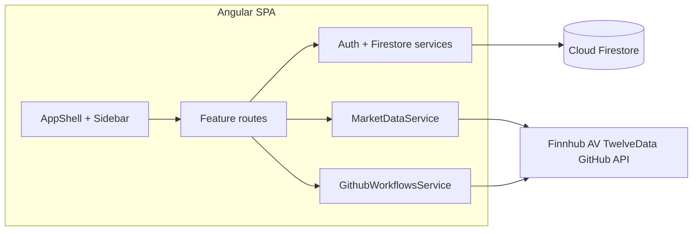

# Angular dashboard architecture

The production UI is an **Angular 19** SPA under [`frontend/`](../frontend/). Global styling remains [`web/styles.css`](../web/styles.css), included from [`frontend/angular.json`](../frontend/angular.json) so existing class names (`.app-shell`, `.positions-table`, etc.) apply unchanged.

## High-level flow



## Folder layout

| Path | Role |
|------|------|
| `frontend/src/app/core/` | Auth, allowlist, Firestore helpers, market data, GitHub dispatch, position/monitor stores, exit dialog |
| `frontend/src/app/layout/` | App shell (sidebar, mobile drawer, exit `<dialog>`), login page |
| `frontend/src/app/features/` | Dashboard, universe, signals, positions, **reporting** (trade + signal join), monitor, about\* |
| `frontend/src/environments/` | Allowlists, `apiBaseUrl`; GitHub workflow dispatch is server-side via Nest (no PAT in the bundle) |

## Firebase

- **Packages:** `@angular/fire` with modular `provideFirebaseApp`, `provideAuth`, `provideFirestore` in [`app.config.ts`](../frontend/src/app/app.config.ts).
- **Localhost:** `environment.isLocalhostAuthOff` → `APP_INITIALIZER` adds `is-localhost-auth-off` on `<html>`; auth is signed out; Universe/Signals remain readable where rules allow; positions/monitor UIs show guest gates (same intent as legacy).

## Firestore (unchanged shapes)

| Collection / query | Usage |
|--------------------|--------|
| `universe` | `orderBy ts_utc desc limit 30` |
| `signals` | `orderBy ts_utc desc limit 25` |
| `my_positions` | `where owner_uid == uid`, `orderBy created_at_utc desc limit 60` |
| `my_positions/{id}/checks` | Monitor expand rows |
| `collectionGroup('checks')` | Monitor tab |

## External APIs (browser today, Nest later)

- **`MarketDataService`:** Finnhub quotes, Twelve Data / Alpha Vantage daily candles (same fallback order as legacy).
- **`GithubWorkflowsService`:** `workflow_dispatch` for `position-monitor.yml` and `trading-bot-scan.yml`; PAT in `localStorage` (same as legacy).

**Nest migration:** set `environment.apiBaseUrl` and replace `fetch` calls in these services with `HttpClient` to the backend; keep method names and call sites stable so feature components change little.

## Legacy vanilla app

The previous `web/index.html` + `web/app.js` entry is archived under [`web/legacy-vanilla/`](../web/legacy-vanilla/) for reference only. Hosting serves the **Angular build** output (see [`firebase.json`](../firebase.json)).

## Deploy

From repo root:

```bash
cd frontend && npm ci && npx ng build
cd .. && firebase deploy --only hosting
```

Public directory: `frontend/dist/trading-signals-web/browser`.
