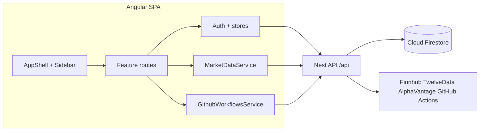

# Angular dashboard architecture

The production UI is an **Angular 19** SPA under [`frontend/`](../frontend/). Global styling remains [`web/styles.css`](../web/styles.css), included from [`frontend/angular.json`](../frontend/angular.json) so existing class names (`.app-shell`, `.positions-table`, etc.) apply unchanged.

## High-level flow



The browser does **not** use the Firebase Web SDK for Auth or Firestore. All data and session auth go through Nest (`HttpClient`, `withCredentials: true`).

## Folder layout

| Path | Role |
|------|------|
| `frontend/src/app/core/` | Auth session client, market data, GitHub dispatch, position/monitor stores, docs catalog |
| `frontend/src/app/layout/` | App shell (sidebar, mobile drawer, exit `<dialog>`), login page |
| `frontend/src/app/features/` | Dashboard, universe, signals, positions, monitor, about (+ Markdown doc viewer) |
| `frontend/src/environments/` | Allowlists, `apiBaseUrl`, `devAuthBypass` |
| `docs/` (build asset) | Copied into the SPA as `/repo-docs/**/*.md` for the About doc viewer |

## Auth

- Google OAuth is handled by Nest (`/api/auth/google`); the SPA session cookie is `signals.sid`.
- Localhost may use `environment.devAuthBypass` + Nest `AUTH_BYPASS_LOCAL` / `DEV_LOCAL_USERS` persona switching.
- Allowlists: `allowedSignInEmails` / `allowedAuthUids` should match Nest `ALLOWED_*` env vars.

## Data access (via Nest)

| Resource | API |
|----------|-----|
| Universe snapshots | `GET /api/universe`, `GET /api/universe/:id/symbols` (`status=active` for scan list) |
| Signals | `GET /api/signals` |
| Positions / monitor | `GET\|POST\|PATCH /api/positions…`, `GET /api/monitor/checks` |
| Market | `GET /api/market/{quote,snapshot,candles}` |
| AI evals (read) | `GET /api/ai-evals`, `GET /api/ai-evals/recent` |
| Workflows | `POST /api/github/workflows/position-monitor` (dashboard **Check** only) |

## Sidebar features

Dashboard, My positions, Signals, Universe, Monitor, AI analytics, About. (Reporting and Events tabs were removed.)

Signals keeps an **AI View** column for stored `ai_evaluation` payloads. There is **no** in-app Re-eval / AI eval button; AI jobs are CLI or GitHub Actions only.

## Docs in the app

About → Documentation lists every file under [`docs/`](./). Route: `/about/docs/:docId` (path with `/` encoded as `--`).

## Legacy vanilla app

Archived under [`web/legacy-vanilla/`](../web/legacy-vanilla/) for reference only. Hosting serves the Angular build (see [`firebase.json`](../firebase.json)).

## Deploy

```bash
cd frontend && npm ci && npx ng build
cd .. && firebase deploy --only hosting
```

Public directory: `frontend/dist/trading-signals-web/browser`.
