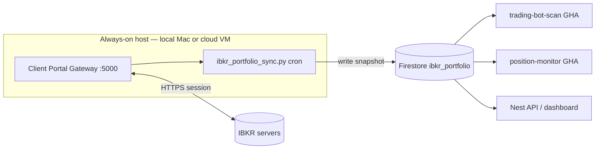

# IBKR Client Portal Gateway — setup & integration plan

This document describes how to add **live IBKR portfolio data** via the **Client Portal Gateway** (`https://localhost:5000/v1/api/`) to this repo, in a way that works **locally first** and can **deploy to cloud later** for ongoing position tracking.

It replaces (or supplements) the current **Flex Web Service** integration, which is batch-oriented and often lags same-day trades.

---

## Goals

| Goal | Approach |
|------|----------|
| Fresh open positions | Client Portal Gateway REST API |
| Signal bot SELL gating | Read holdings from **Firestore**, not directly from IBKR in CI |
| Dashboard / monitor | Same Firestore snapshot the bot uses |
| Cloud later | Always-on **gateway worker VM** writes to Firestore; serverless jobs **read only** |

**Important:** GitHub Actions and Cloud Run **cannot** host the Client Portal Gateway session. IBKR expects the gateway on a machine you control, with an authenticated browser/login session. Cloud deployment means a **small persistent VM** (or home server), not a stateless cron on `ubuntu-latest`.

---

## Architecture (target state)



**Data flow**

1. Gateway stays logged in (manual or automated re-auth).
2. Sync job runs every N minutes: `GET /portfolio/accounts` → `GET /portfolio/{accountId}/positions/0`.
3. Normalized snapshot written to Firestore with `ts_utc`.
4. Python bot, monitor, and Nest API read Firestore — **no IBKR credentials in GitHub Actions**.

This mirrors how you already use Firestore for universe and signals: **IBKR is upstream; Firestore is the integration bus**.

---

## Phase 0 — Local gateway only (1–2 hours)

### 0.1 Download & run

1. Download **Client Portal Gateway** from [IBKR Campus — Web API](https://www.interactivebrokers.com/campus/ibkr-api-page/cpapi-v1/) (Java app).
2. Unzip and start (typical layout):
   ```bash
   cd clientportal.gw
   bin/run.sh root/conf.yaml
   ```
3. Open **`https://localhost:5000`** in a browser → log in (paper or live) → complete 2FA.
4. Confirm session:
   ```bash
   curl -k 'https://localhost:5000/v1/api/iserver/auth/status'
   ```
   Expect `"authenticated": true`.

### 0.2 macOS port conflict

If port 5000 is taken (often AirPlay Receiver): edit `root/conf.yaml` → change `listenPort` (e.g. `5001`) and use `https://localhost:5001/v1/api/` everywhere.

### 0.3 Smoke-test portfolio endpoints

```bash
BASE='https://localhost:5000/v1/api'

# Accounts
curl -k "$BASE/portfolio/accounts"

# Replace ACCOUNT_ID from response
curl -k "$BASE/portfolio/ACCOUNT_ID/positions/0"
curl -k "$BASE/portfolio/ACCOUNT_ID/summary"
```

Keep gateway running while testing. Session expires — re-login when `authenticated` becomes `false`.

### 0.4 Do **not** put this in GitHub Actions yet

The premarket scan workflow (`.github/workflows/trading-bot-scan.yml`) today uses `FLEX_API_KEY`. Flex works from anywhere but is stale. Gateway **must** run where you authenticate; CI stays on Firestore reads after Phase 2.

---

## Phase 1 — Repo integration (provider + test script)

Add a new Python module (proposed paths):

| File | Role |
|------|------|
| `src/signals_bot/providers/ibkr_cp_gateway.py` | HTTP client: auth check, accounts, positions, summary |
| `scripts/ibkr_cp_gateway_test.py` | CLI smoke test (like `ibkr_flex_test.py`) |
| `scripts/sync_ibkr_portfolio.py` | Fetch positions → write Firestore |

### 1.1 Config & env

**`config.yaml`** (proposed section):

```yaml
ibkr:
  host: "127.0.0.1"
  port: 7497          # existing — TWS scanner only
  client_id: 7
  connect_timeout_sec: 5
  client_portal:
    enabled: false
    base_url: "https://localhost:5000/v1/api"
    verify_ssl: false   # gateway uses self-signed cert
    account_id: ""      # optional; auto-pick first if empty
    sync_interval_min: 5
```

**`.env`** (proposed):

```bash
IBKR_CP_GATEWAY_URL=https://localhost:5000/v1/api
# IBKR_CP_ACCOUNT_ID=U1234567   # optional
```

No IBKR password in env — authentication stays in the gateway browser session (Phase 3 automates re-login on the VM only).

### 1.2 Normalized holdings shape

Match what `fetch_holdings_and_latest_buys()` returns today so `main.py` changes stay small:

```python
holdings: set[str]           # ticker symbols
merged: dict[str, dict]      # { "AAPL": {"price": avg_cost, "time": None, "qty": 10, "mkt_value": ...} }
```

Map Client Portal position fields (e.g. `ticker`, `avgCost`, `position`, `mktValue`, `conid`) into this structure.

### 1.3 Firestore schema (new collection)

Document: **`ibkr_portfolio/{account_id}`** (or single doc `ibkr_portfolio/latest` if one account)

```json
{
  "account_id": "U1234567",
  "ts_utc": "2026-05-28T14:30:00Z",
  "source": "client_portal_gateway",
  "authenticated": true,
  "positions": [
    {
      "ticker": "AAPL",
      "qty": 10,
      "avg_cost": 190.5,
      "mkt_value": 1950.0,
      "unrealized_pnl": 45.0,
      "conid": 265598
    }
  ],
  "summary": {
    "net_liquidation": 50000.0,
    "buying_power": 12000.0
  }
}
```

Optional subcollection **`ibkr_portfolio/{account_id}/history/{ts_utc}`** for audit charts (later).

### 1.4 Test script

```bash
PYTHONPATH=./src python scripts/ibkr_cp_gateway_test.py --config config.yaml
PYTHONPATH=./src python scripts/sync_ibkr_portfolio.py --config config.yaml --dry-run
```

---

## Phase 2 — Wire into the signal bot & monitor

### 2.1 Holdings provider priority

In `main.py`, replace direct Flex call with a resolver:

```
1. If client_portal.enabled AND Firestore snapshot fresh (< 30 min) → read Firestore
2. Else if gateway reachable locally → fetch live → optional write-through to Firestore
3. Else if FLEX_API_KEY set → Flex fallback
4. Else → no holdings gate (current behavior)
```

Freshness threshold avoids CI depending on a dead gateway.

### 2.2 GitHub Actions change

`.github/workflows/trading-bot-scan.yml`:

- Remove hard dependency on `FLEX_API_KEY` for holdings (optional fallback).
- Bot reads **`ibkr_portfolio/latest`** from Firestore (already has `GOOGLE_APPLICATION_CREDENTIALS`).

Premarket scan stays serverless; **sync job** on VM keeps Firestore updated.

### 2.3 Position monitor

`scripts/monitor_open_positions.py` today uses Firestore `my_positions` (manual entries). Optional later enhancement:

- Reconcile `my_positions` qty vs `ibkr_portfolio` snapshot.
- Flag drift in Slack (signal-only — no auto-trading).

---

## Phase 3 — Cloud deployment (gateway worker)

### 3.1 Recommended topology

| Component | Where | Why |
|-----------|--------|-----|
| Client Portal Gateway | **VM** (GCP Compute e2-small, Hetzner, home NUC) | IBKR session + localhost API |
| IBeam or custom re-auth | Same VM | Headless login + 2FA handling |
| `sync_ibkr_portfolio.py` | Same VM, cron/systemd timer | Push to Firestore every 5–15 min |
| Nest API / Firebase Hosting | Cloud Run / Firebase (existing) | Read Firestore only |
| trading-bot-scan GHA | GitHub Actions (existing) | Read Firestore only |

**Do not** expose port 5000 to the public internet. Bind to `127.0.0.1`; only the sync script on the VM talks to it. SSH or Tailscale for admin login to re-auth.

### 3.2 Docker Compose sketch (VM)

```yaml
# deploy/ibkr-gateway/docker-compose.yml (future)
services:
  gateway:
    image: ghcr.io/gabrielbussolo/ibkr-api-gateway:latest   # or official IBKR zip in Dockerfile
    ports:
      - "127.0.0.1:5000:5000"
    volumes:
      - ./conf.yaml:/root/conf.yaml

  ibeam:
    image: voyz/ibeam:latest                                # optional: automates login
    environment:
      IBEAM_ACCOUNT: ${IBKR_USERNAME}
      IBEAM_PASSWORD: ${IBKR_PASSWORD}
      IBEAM_KEY: ${IBKR_2FA_SECRET}                         # if using TOTP
    depends_on:
      - gateway

  sync:
    build: ../../                                            # repo root
    command: python scripts/sync_ibkr_portfolio.py --config config.yaml --loop
    env_file: .env
    environment:
      IBKR_CP_GATEWAY_URL: https://gateway:5000/v1/api
      GOOGLE_APPLICATION_CREDENTIALS: /secrets/firebase.json
    volumes:
      - ./secrets:/secrets:ro
    depends_on:
      - gateway
```

Secrets on VM only: IBKR credentials (for IBeam), Firebase service account JSON, optional `IBKR_CP_ACCOUNT_ID`.

### 3.3 Sync schedule

| Market hours | Interval |
|--------------|----------|
| US session (09:30–16:00 ET) | Every **5 min** |
| Off hours / weekends | Every **30–60 min** (session may still expire) |

Use `systemd` timer or cron on the VM. Log `authenticated: false` to Slack so you know to re-login.

### 3.4 Security checklist

- [ ] Gateway listens on **127.0.0.1** only
- [ ] VM firewall: no inbound 5000
- [ ] IBKR credentials **only** on VM (not GitHub Secrets for password)
- [ ] Firebase SA with **minimal** Firestore write to `ibkr_portfolio` only
- [ ] Tailscale or IAP for SSH — no public SSH
- [ ] Paper account first until sync + bot gating validated

### 3.5 Institutional alternative (future)

IBKR **OAuth / hosted Web API** can avoid a local gateway for qualified accounts. Retail individuals typically use Client Portal Gateway. Revisit if your account type changes.

---

## Phase 4 — Dashboard (optional)

Expose read-only API in Nest:

- `GET /api/ibkr/portfolio` → latest Firestore snapshot
- Show on monitor page: last sync time, positions table, `authenticated` flag

Frontend already uses Firestore-backed APIs; this is a thin controller + existing auth.

---

## Implementation checklist (ordered)

### Week 1 — Local proof

- [ ] Run gateway locally; confirm `auth/status` + positions JSON
- [ ] Add `ibkr_cp_gateway.py` + `ibkr_cp_gateway_test.py`
- [ ] Add `sync_ibkr_portfolio.py` → Firestore dry-run then write
- [ ] Verify snapshot in Firebase Console

### Week 2 — Bot integration

- [ ] Add `read_ibkr_portfolio_from_firestore()` in `firestore.py`
- [ ] Update `main.py` holdings resolver (Firestore → gateway → Flex)
- [ ] Run `./run.sh` locally with gateway up; confirm SELL gating uses live symbols
- [ ] Update `.env.example` + config.yaml comments

### Week 3 — Cloud worker

- [ ] Provision VM; install Docker Compose stack
- [ ] Configure IBeam or manual login procedure doc
- [ ] systemd timer for sync; alert on auth failure
- [ ] Remove Flex from GHA secrets (optional keep as fallback)

### Week 4 — Polish

- [ ] Nest `/api/ibkr/portfolio` + monitor UI “IBKR sync” badge
- [ ] Reconciliation report vs `my_positions`
- [ ] Runbook: session expired, 2FA, competing session

---

## Comparison: Flex vs Client Portal Gateway

| | Flex (today) | Client Portal Gateway |
|--|--------------|------------------------|
| Setup | Token + query ID | JVM gateway + browser login |
| Runs in GHA | Yes | No — needs VM |
| Position freshness | Often EOD | Near real-time |
| Best for | Simple CI fallback | Live tracking + cloud via Firestore sync |
| This repo | `ibkr_flex.py` | **Planned** `ibkr_cp_gateway.py` + sync |

**Recommendation:** Keep Flex as **fallback** until gateway sync is stable in cloud. Primary source of truth for holdings → **Firestore `ibkr_portfolio`**.

---

## Quick reference — API endpoints

Base URL: `https://localhost:5000/v1/api` (or your `listenPort`)

| Method | Path | Use |
|--------|------|-----|
| GET | `/iserver/auth/status` | Session alive? |
| POST | `/iserver/reauthenticate` | Refresh session (when supported) |
| GET | `/portfolio/accounts` | Account list |
| GET | `/portfolio/{accountId}/positions/{pageId}` | Open positions |
| GET | `/portfolio/{accountId}/summary` | Balances / NLV |

All requests: `verify=False` / `curl -k` due to self-signed cert.

---

## Next step

Switch to **Agent mode** and ask to implement **Phase 1** (provider + test script + Firestore sync + config stubs). That gives you a working local loop before any cloud spend.
