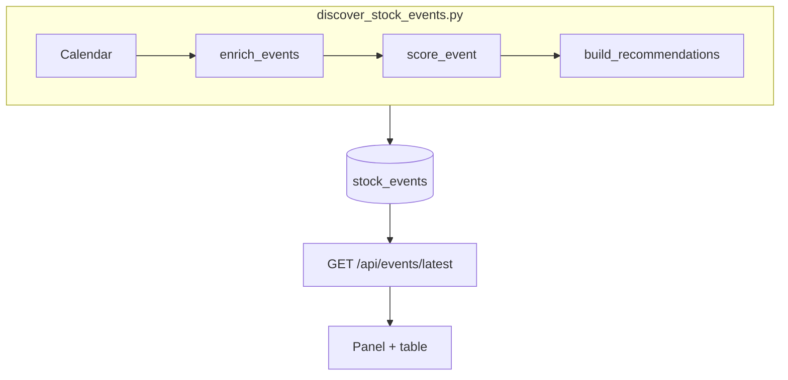

# Stock events feature (master doc)

> MVP details: [`stock-events-mvp.md`](stock-events-mvp.md). This file tracks **overall status**, Phase 2 scoring/UI, and what is still missing.

Signal-only: recommendations are **SETUP / WATCH / AVOID** labels, not trade orders.

## Status

| Item | Phase | State |
|------|-------|--------|
| Calendar discovery (Finnhub + Yahoo) | MVP | Done (top **1000** by `last_score`) |
| Events table on `/events` | MVP | Done |
| GitHub Action `stock-events-daily.yml` | MVP | Done |
| OHLC setup metrics per symbol | 2 | Done |
| Historical earnings reaction | 2 | Done |
| Deterministic `event_score` + bias + action | 2 | Done |
| Firestore `recommendations[]` | 2 | Done |
| UI recommendations panel above table | 2 | Done |
| Table columns: score, action, bias, RS/ext | 2 | Done |
| All-events table pagination (50/page) | 2 | Done |
| Unit tests `test_event_scoring.py` | 2 | Done |
| AI eval `event_timing_score` from snapshot | 2.1 | Not started |
| NYSE session-aligned post-earnings windows | 2.1 | Not started |

## Architecture



| Layer | Path |
|-------|------|
| Scoring | [`src/signals_bot/events/`](../src/signals_bot/events/) |
| Job | [`scripts/discover_stock_events.py`](../scripts/discover_stock_events.py) |
| API | [`backend/src/events/`](../backend/src/events/) |
| UI | [`frontend/src/app/features/events-page/`](../frontend/src/app/features/events-page/) |

## Firestore schema

**Collection:** `stock_events/{asof_date}`

### v1 (MVP) event row

`symbol`, `event_type`, `event_date`, `event_time`, `title`, `eps_estimate`, `revenue_estimate`, `last_score`, `last_confidence`, `data_source`

### v2 additions

**Document:** `recommendations[]`, `source: discover_stock_events_v2`

**Per event:** `setup`, `history` (earnings only), `event_score`, `bias`, `action`, `reasons[]`

See scoring spec below.

## Scoring spec

### Actions

| Action | Meaning |
|--------|---------|
| **SETUP** | High `event_score`, aligned technicals, not over-extended, favorable history (earnings) |
| **WATCH** | Interesting catalyst with one gap (extension, mixed history, weak volume) |
| **AVOID** | Low score, extended, bearish history, or weak universe momentum |

### Bias

`bullish` / `neutral` / `bearish` from composite score bands.

### Earnings weights (max 100)

| Component | Pts |
|-----------|-----|
| universe_momentum | 20 |
| technical_alignment | 25 |
| relative_strength | 15 |
| event_timing | 10 |
| pre_event_extension | 15 |
| historical_edge | 15 |

### Ex-dividend / dividend weights (max 100)

| Component | Pts |
|-----------|-----|
| universe_momentum | 30 |
| technical_alignment | 25 |
| timing | 15 |
| extension penalty | 15 |
| dividend_slot | 15 (neutral if no yield data) |

Thresholds in `config.yaml` → `events.setup_min_score`, `watch_min_score`, `min_recommendation_score`.

## UI spec

1. **Top recommendations** panel above the table (rank, ticker, action badge, bias, score, date, summary).
2. **Table** sorted by `event_score` DESC; recommended rows highlighted.
3. **Info** toggle per row: expands event/score/setup/history from Firestore plus live Finnhub company profile & quote via `/api/market/snapshot`.
4. **All events** table: client-side pages of **50** rows (Prev/Next), same controls as Universe symbol paging.
5. Disclaimer: signal-only, not investment advice.

`events.top_symbols` defaults to **1000**. Yahoo fallback is capped by `events.yahoo_fallback_max` (default 200, highest scores first) so CI stays within runtime limits.

## How to run

```bash
# Full pipeline (calendar + enrich + score)
PYTHONPATH=./src python3 scripts/discover_stock_events.py --config config.yaml

# Calendar only (fast)
PYTHONPATH=./src python3 scripts/discover_stock_events.py --config config.yaml --skip-enrichment --dry-run

pytest scripts/test_event_scoring.py
```

## Missing parts (continue later)

- [ ] Phase 2.1: Wire `ai_stock_eval` `events_text` + `event_timing_score` from latest `stock_events`
- [ ] Phase 2.1: Post-earnings returns on NYSE session dates (not calendar days)
- [ ] Phase 3: Implied vol / historical earnings move vs straddle
- [ ] Phase 3: EPS estimate revision trend
- [ ] Phase 3: Macro-week flag (`economic_calendar`)
- [ ] Phase 3: `scripts/backtest_event_reactions.py`
- [ ] Phase 3: Slack digest of top recommendations
- [ ] Phase 3: EODHD earnings calendar provider

## Phase 3 backlog

Optional data providers and research tooling — see checkboxes above. No ML in v1; keep deterministic ranks unless explicitly approved.
